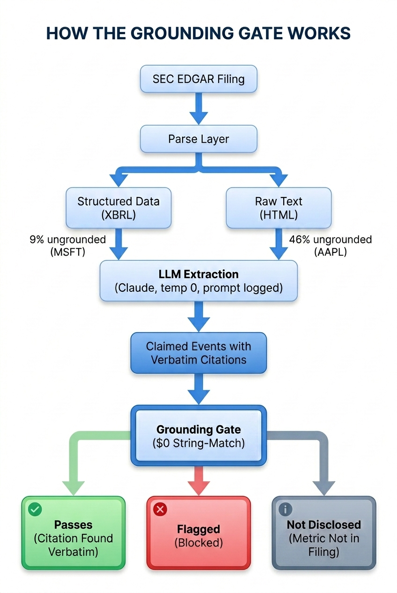

# HR Fidelity

> **Can you trust the AI reading your résumés?**

[](https://hr-fidelity-schu.fly.dev)

[](https://hr-fidelity-schu.fly.dev)

An integrated AI governance evaluation pipeline for resume screeners. The system combines disparate impact analysis, proxy-signal detection, counterfactual testing, recruiter calibration, and deployment gating into a single reproducible workflow — issuing a machine-readable CERTIFIED or BLOCKED verdict before the screener touches a live application.

**All data is 100% synthetic. No real candidates. No employer records. [See disclosure ↓](#data-disclosure)**

---

## The problem

In 2014–2017, Amazon built an ML hiring tool. Trained on past hires — who skewed male — it taught itself to penalize the word *"women's"* and downgrade graduates of two all-women's colleges. Amazon scrapped it in 2017.

**The law caught up.** NYC **Local Law 144** (in force, 2023) mandates a bias audit for any "automated employment decision tool." The **EU AI Act** classifies hiring as high-risk and requires conformity assessment. **California FEHA** and CRD guidance extend disparate-impact liability to AI employment tools statewide.

The screener is not the hard part. The evaluation layer is.

---

## The evaluation pipeline

The screener is the **subject under test**. The pipeline takes its scores as input and runs three independent checks before issuing a verdict.

```mermaid
flowchart TD
    R[Resume pool\n150 synthetic résumés]
    Q[Job requisition\nrequired skills · scoring rubric]

    R --> SCREEN
    Q --> SCREEN

    SCREEN["LAYER 1 — SCREENER  ·  subject under test\n\nscore(resume, req, config) → Score\n\nKnobs: prestige bonus · name-based signals · skills weight · advance threshold"]

    SCREEN -->|"150 base scores"| FF
    SCREEN -->|"450 matched-pair scores"| CD
    SCREEN -->|"20 A/B pair scores"| KA

    subgraph AUDIT["LAYER 3 — AUDIT"]
        FF["Four-fifths disparate impact\nEEOC § 60-3.4 / NYC LL 144\nratio ≥ 0.80 per demographic group"]
        CD["Counterfactual drift\nproxy-signal detection\nmean score drift ≤ 0.05 across matched pairs"]
        KA["Recruiter–AI agreement\nCohen's κ ≥ 0.60\nblind A/B vs 3 synthetic recruiters"]
    end

    FF --> GATE
    CD --> GATE
    KA --> GATE

    GATE{All three checks pass?}

    GATE -->|Yes| CERT["✅  CERTIFIED\nScreener cleared for deployment"]
    GATE -->|No|  BLOCK["🚫  BLOCKED\nWhich check failed · which proxy caused it · plain-English reason"]
```

The audit layer is screener-agnostic — it receives scores and measures their properties. Swap the rubric for an LLM, a fine-tuned classifier, or a third-party vendor API behind the `score(resume, req, config) → Score` interface and the audit runs unchanged.

**[→ Full architecture diagram + module map](docs/ARCHITECTURE.md)**



**Four-fifths disparate impact (EEOC § 60-3.4 / NYC LL 144 / California FEHA):** any demographic group selected at less than 80% of the top group's rate triggers a violation. Measured from synthetic self-reported EEO race — the same basis real HR compliance uses, not name inference. Groups below the statistical minimum sample size are shown in the table but excluded from the verdict.

**Counterfactual drift (proxy detection):** every résumé gets a matched twin — identical skills and experience, one proxy signal swapped (name, institution tier, or gender signal). Mean score drift > 5% blocks certification. Pairs are grounded in Bertrand & Mullainathan (2004). The counterfactual invariant — content hash equality between twins — is mechanically enforced and CI-tested.

**Recruiter–AI agreement (Cohen's κ):** measures whether the AI and three synthetic human recruiters agree on A/B pairs. κ ≥ 0.60 ("substantial" agreement) is required. Gold pairs act as attention checks. The claim is never "the AI is correct" — it's "the AI agrees with calibrated human judgment."

**Deployment gating:** the CERTIFIED / BLOCKED verdict is the integration point. The screener only operates when all three layers clear. This is the governance pattern emerging in AI Act and LL 144 compliance discussions: evaluation results gate deployment, not just inform it.

### Regulatory frameworks referenced

| Framework | Jurisdiction | What it requires |
|---|---|---|
| EEOC Uniform Guidelines (four-fifths rule) | Federal (US) | Disparate impact baseline for all employment tools |
| NYC Local Law 144 | New York City | Annual third-party bias audit + public disclosure for AEDTs |
| California FEHA / CRD AI guidance | California | Disparate impact liability under state anti-discrimination law |
| EU AI Act (Annex III) | European Union | Conformity assessment for high-risk hiring systems |

---

## Why we built the rubric screener first

The screener (Layer 1) is the **subject under test**, not the product. The audit layer is the product.

We built a deterministic, rubric-based screener first — deliberately, not as a shortcut. The reasons:

**Verify the audit before auditing anything opaque.** With a transparent rubric, you can inject *known* bias — set `race_proxy_bias["black"] = -0.20` — and confirm the four-fifths check catches it. If your audit can't detect bias you manually injected, it won't detect bias a model learned implicitly. Rubric-first lets you prove the audit instrument works before pointing it at a black box.

**Separate the audit layer from the screener implementation.** The `score(resume, req, config) → Score` interface is the only contract. The audit layer never calls the screener directly — it receives scores and measures their properties. This makes the audit layer screener-agnostic: swap the rubric for an LLM, a fine-tuned classifier, or a third-party vendor API, and the audit runs unchanged. The interface was designed for this.

**Reproduce the Amazon failure on demand.** The rubric's bias knobs (`prestige_bonus`, `race_proxy_bias`, `gender_bias`) let you recreate Amazon's failure mode in a live demo — and watch the audit catch it. An LLM screener would show emergent bias, which is more realistic but harder to explain and reproduce reliably. The rubric version makes the mechanism legible.

The LLM screener (M5) plugs in behind the same interface. The audit layer doesn't change.

---

## The demo arc

1. **Default config** — screener passes all three checks. CERTIFIED.
2. **Enable name-based signals** — screener now sees race/gender proxies from applicant names. Four-fifths ratios drop. Drift spikes. BLOCKED.
3. **Toggle prestige bonus** — elite-school weighting introduces proxy correlation. Watch the verdict flip in real time.

---

## Counterfactual invariant

The audit claim — "score drift is caused by the protected proxy" — is only defensible if the twins are truly identical in job-relevant content. The generator enforces this mechanically:

```python
content_hash(skills, experience, education)  # must be equal across twins
proxy_field                                  # must differ: name, gender, prestige_tier
```

Any pair whose job-relevant hash differs is rejected before it enters the corpus. Identity independence is also enforced: in the base population, `identity ⊥ latent_fit`. Any score–demographic correlation in screener output is bias introduced by the screener, not baked into the data.

---

## Build status

| Milestone | Status | What |
|---|---|---|
| M1 — Data foundation | ✅ | Schema · req fixtures · SSA/Census/B-M name loaders · résumé generator · counterfactual invariant · CI checks |
| M2 — The failing demo | ✅ | Rubric screener · four-fifths audit · counterfactual drift probe |
| M3 — Fidelity layer | ✅ | Blind A/B pairing · Cohen's κ · Fleiss' κ · gold pair accuracy |
| M4 — Certification dashboard | ✅ | FastAPI server · live config knobs · CERTIFIED/BLOCKED verdict · deployed |
| M5 — LLM screener | ✅ | Swap rubric for Claude (Haiku) behind the same interface · blind prompt · emergent bias visible in audit |
| M6 — Pair comparison UI | ⬜ | Side-by-side counterfactual pairs showing identical résumés scored differently |
| M7 — Methodology page | ⬜ | GitHub Pages explainer — statistical choices, regulatory citations, Bertrand-Mullainathan grounding |

**249 tests passing, 0 failures.**

---

## Stack

- **Python 3.12** — FastAPI, uvicorn, pytest (249 tests), httpx
- **Statistics** — Cohen's κ, Fleiss' κ, EEOC four-fifths ratio, counterfactual mean drift
- **Frontend** — vanilla JS, GSAP 3 (hero animations, ScrollTrigger, mouse parallax), no framework
- **Deploy** — Docker, Fly.io (`shared-cpu-1x`, 256 MB)
- **Data** — 100% synthetic; SSA, US Census, Bertrand-Mullainathan public datasets

---

## Data disclosure

| Source | Used for |
|---|---|
| SSA baby-name data (vendored sample) | First names → inferred gender |
| US Census 2010 surname file (vendored sample) | Surnames → inferred race proxy (white/Black binary — for counterfactual drift only) |
| Bertrand & Mullainathan (2004) name pairs | Counterfactual swaps — white- and Black-signal first names |
| EEOC EEO-1 / tech-sector EEO-1 filings (public) | Calibration weights for synthetic self-reported race (eeo_race) |

**Two race fields, two purposes:**

- `inferred_race_proxy` — name-inferred signal (white/Black), used only for counterfactual drift. Grounded in B-M. Binary by design — the B-M pairs are the axis.
- `eeo_race` — synthetic self-reported EEO race (white/Black/Hispanic/Asian), assigned independently of name via a probability matrix calibrated to tech-sector EEO-1 demographics. This is what the four-fifths disparate impact check uses — the same basis real HR compliance uses. Asian engineers in tech often have Western first names (→ white proxy) but self-report Asian; the matrix models this realistically.

Names and demographic fields are proxies for inferred signal, not real identity. The generation method is committed to this repo so a reviewer can verify it is honest synthetic data, not scraped.

Hard rules: no "culture fit" scoring (discrimination vector). Screener scores against a fixed req-derived rubric only — never trained on past hires. That is the Amazon rule.

---

*Layer 2 fidelity method (blind A/B + κ) reused from [concord](https://github.com/stephendchu/agentic-test-eval).*
